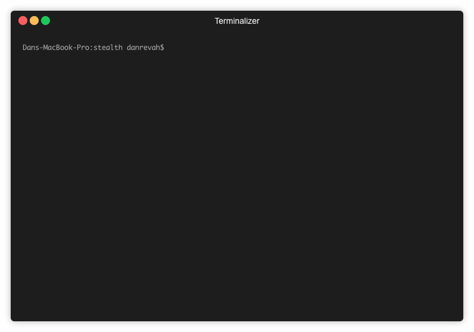

#  Stealth Project

Emulating an encrypted tunnel using relays (Based on TOR concept).

## Examples

*Client:*


*Trusted Server:*


*Relay:*


## Configuration
In `com/openu/security/tor/app/Services/Config.java` we should configure TrustedServer IP, PORT and PUBLIC_KEY.
This is hardcoded into the client & relays in order to prevent MITM attacks.

```java
public class Config {
    public final static String TRUSTED_SERVER_HOST = "127.0.0.1";
    public final static String TRUSTED_SERVER_PORT = "3000";
    final static public String TRUSTED_SERVER_PUBLIC_KEY = "...";

}
```
## Install

```sh 
$ mvn install
```

## Compile

```sh 
$ mvn clean compile assembly:single
```

## Run tests

```sh 
$ mvn test
```

## Run

```sh 
$ ./bin/proxy 
```

## WARNING

1. In order this to be secured, the TrustedServer should be compiled on a different project.
Since the private-key is hardcoded and the client and relay jar's should not have access to this information.

2. Private & Public key is included in this repository which is not safe to use, generation of a new key pair is required.

## TODO

1. Warnings must be taken care of

2. TrustedServer should ping relays every X seconds to validate is alive.

3. "@TODO" leftovers should also be taken care of